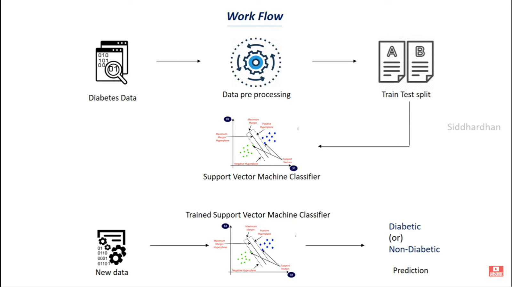

# Diabetes Prediction using Machine Learning



## Overview

This project aims to predict the likelihood of diabetes in patients using various machine learning algorithms. The dataset used for this project is sourced from the National Institute of Diabetes and Digestive and Kidney Diseases.

## Features

-   Data preprocessing and cleaning
-   Exploratory data analysis
-   Model training and evaluation
-   Hyperparameter tuning
-   Model deployment

## Installation

1. Clone the repository:
    ```bash
    git clone https://github.com/dipto-kainin/Diabetes-Prediction-using-Machine-Learning.git
    ```
2. Navigate to the project directory:
    ```bash
    cd Diabetes-Prediction-using-Machine-Learning
    ```
3. Install the required dependencies:
    ```bash
    pip install -r requirements.txt
    ```

## Usage

1. Run the data preprocessing script:
    ```bash
    python preprocess.py
    ```
2. Train the model:
    ```bash
    python train.py
    ```
3. Evaluate the model:
    ```bash
    python evaluate.py
    ```

## Acknowledgements

-   National Institute of Diabetes and Digestive and Kidney Diseases for the dataset.
-   All contributors and supporters of this project.
